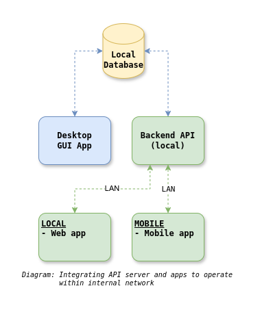

# HMSNOOR Backend

__HMSNOOR__ is an existing _Hotel Management System_ written in C# .NET Framework Winforms using Microsoft SQL Server.

__HMSNOOR Backend__ is a backend API to work with existing local SQL Server database (in which Winform application is using) to operate Sale feature internally within local network.
There will be _frontend apps_ to work with HMSNOOR Backend for sale operations.

